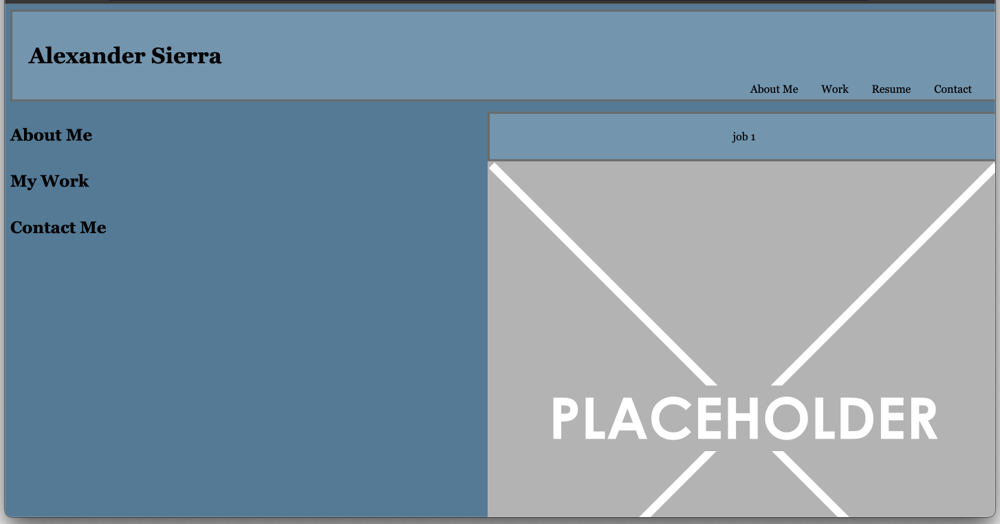

# Alex Sierra's Portfolio

## Description

This repository is a work in progress. Its intention is to better my skills working with the styles of CSS as a growing developer. The amount of time I spent working on this is not clear with the lack of progress I have made. A mere stepping stone for me, as I am still learning and will have to return to this repo to not only finish, but also clean up, my own portfolio to impress potential employers. 

When I am finished, this portfolio will be primarily used similarly to that of a resume or cover letter for pursuing new employment. It will also be used as a reminder, or even be seen as an original piece of artwork (in my own eyes) to remember where I came from in my journey through this new field.

## Installation

N/A

## Usage

When complete, others will be able to view my portfolio to see my previous work that I am most proud of, and also the work that I feel represents my skills in the best possible way. 

Deployed Website Link-
https://asierra619.github.io/asierra-portfolio/

## Credits

Placeholder images taken from Google Images
Thank you!

## License

MIT License